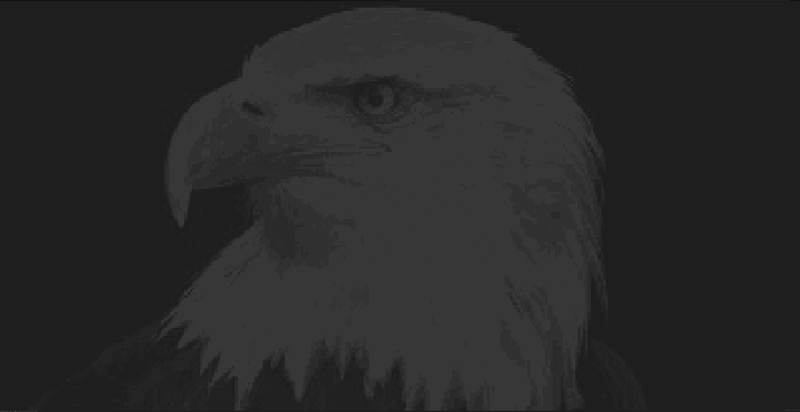

# Print an image on the terminal using ASCII characters


## How to run 
```
cargo run <Path to image> <desired width resoulution>
```

If the image does not fit in the screen, you will get an error such as:
```
Some info: Screen size: (178,45) Image size: (700,364)
thread 'main' panicked at 'The image does not fit in the terminal, please zoom out or lower resolution', src/main.rs:43:9
```

This indicates that the image does not fit in the terminal in the desired resoultion. To fic this, lower the desired width resolution or zoom out so that more characters fit in screen


## Example
The following image:


 with a desired width resolution of 700, showed the following in the terminal:
 
